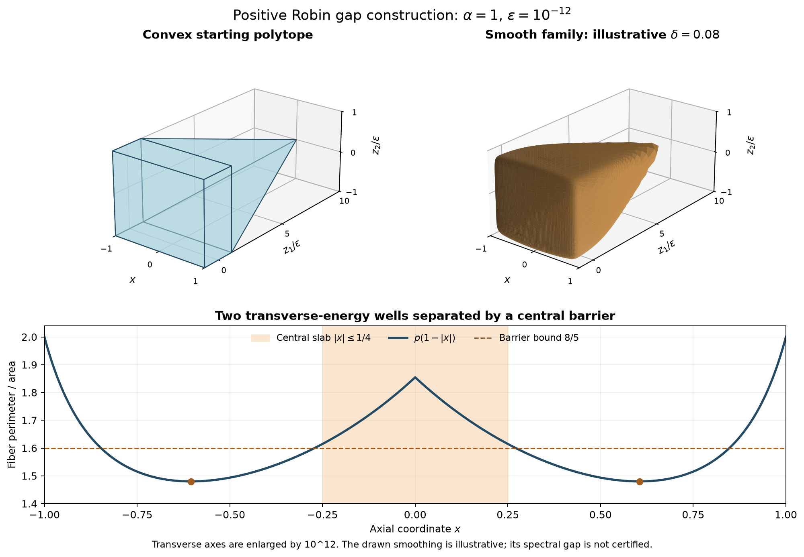

# Positive-Robin gap collapse in smooth convex three-dimensional domains

**Author:** Matthew J. Colbrook, Department of Applied Mathematics and Theoretical Physics, University of Cambridge, Cambridge CB3 0WA, United Kingdom. Email: [m.colbrook@damtp.cam.ac.uk](mailto:m.colbrook@damtp.cam.ac.uk).

**Target:** Original problem 021, *The Robin fundamental gap conjecture*, at repository revision `37a25361f243be77daea0ae0b3c5167b57f1b5f3`; [pinned statement](https://github.com/MColbrook/AIM/blob/37a25361f243be77daea0ae0b3c5167b57f1b5f3/problems/021-robin-fundamental-gap.md) and [local snapshot](statement.md).

**Submission status:** Solution claimed, for processing through the repository's resolution-review workflow. The originating argument was supplied in a separate AI-assisted candidate package. Author attribution was requested by the repository owner. Editorial packaging, reference checking and mathematical audit were performed by OpenAI Codex (AI); this does not assert independent human peer review, publication acceptance or Lean verification. The repository's current decision is recorded in the [resolution archive](../../../RESOLVED.md).

The proposed counterexample uses the same positive Robin parameter on a smooth strictly convex domain and its diameter-matched comparison interval:

```math
U\subset\mathbb R^3,\qquad \alpha=1,\qquad
\rho_2(U;1)-\rho_1(U;1)<0.221<2<
\rho_2((0,\mathop{\mathrm{diam}}U);1)-\rho_1((0,\mathop{\mathrm{diam}}U);1).
```

Read the [complete manuscript (PDF)](robin_gap_021.pdf), [editable standalone LaTeX source](robin_gap_021.tex), and [resolution report](RESOLUTION_REPORT.md). The [reference audit](REFERENCES.md) identifies all seven bibliography entries and the standard analytic dependencies. [SUBMISSION.json](SUBMISSION.json) and [submission-original/](submission-original/) preserve the uploaded files and their hashes; [SHA256SUMS.txt](SHA256SUMS.txt) identifies the packaged revision.



The transverse axes are enlarged by a factor of $`10^{12}`$. The right-hand domain uses illustrative $`\delta=0.08`$; it is not asserted to be a certified counterexample. The theorem first fixes $`\varepsilon=10^{-12}`$ and proves the existence of a sufficiently small smoothing parameter by spectral convergence. The [SVG](domain.svg) and [drawing script](draw_domain.py) are also provided. The manuscript includes a standalone vector diagram without external image dependencies.

## Reproduction

The supplied checker requires only Python 3.10 or later:

```sh
python research/solutions/021-robin-gap-counterexample/check_counterexample.py --output research/solutions/021-robin-gap-counterexample/checks.json
```

It passes 25 exact rational checks and nine floating-point polygon checks. [checks.json](checks.json) records the output; it agrees with the uploaded result. These computations check arithmetic and geometry, not the full three-dimensional eigenproblem.

Packaged text and generated JSON use UTF-8 with LF line endings on every platform. The packaged checker changes only that output encoding convention from the unchanged uploaded script. The checksum manifest identifies the repository bytes; the document-production record also identifies the equivalent CRLF source used for compilation.

The separate auditor requires SymPy (tested with 1.14.0):

```sh
python research/solutions/021-robin-gap-counterexample/verify_independently.py
```

[independent-checks.json](independent-checks.json) records 40 exact geometry, symbolic and cross-reference checks. To redraw, run `draw_domain.py` with NumPy and Matplotlib (tested with 2.5.3 and 3.11.2). The drawing script also regenerates the embedded manuscript diagram.

To export the manuscript with an installed LaTeX distribution, run twice from this directory:

```sh
pdflatex -interaction=nonstopmode -halt-on-error robin_gap_021.tex
```

All citations and equation/figure/section references resolve. The packaged PDF was compiled twice without final LaTeX or box warnings and all nine pages were inspected. The proof audit is separate from document-production checks and computational corroboration.
